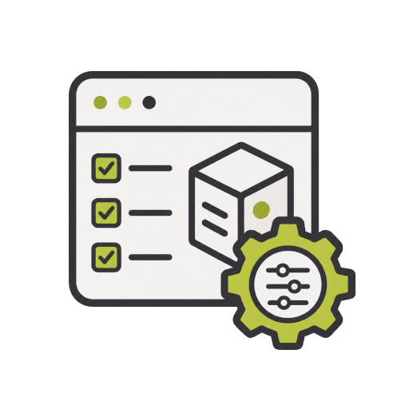

<div align="center">
  
</div>

<h1 align="center">platform-config</h1>

<p align="center">
  Public Ansible configuration for platform hosts, services, and safe example inventories.
</p>

---

`platform-config` configures already-provisioned hosts with Ansible. It
contains public playbooks, roles, examples, helper scripts, and documentation
for production-oriented operating system and service configuration.

The repository is one part of a split platform project. Template building,
infrastructure provisioning, system configuration, Kubernetes bastion tooling,
documentation, and shared helper tools live in separate repositories so each
layer can evolve independently. Site-specific and personal configuration stays
outside this public repository.

## Scope

This repository owns public Ansible code: playbooks, roles, examples, Ansible
support scripts, and documentation. Shared human and CI operator commands belong
in `platform-tools`.

It configures already-provisioned hosts. It does not create VMs, build Proxmox templates, manage OpenTofu state, or store secrets.

Only safe examples belong here. Real inventories, host variables, access policies, CA certificates, and non-secret environment-specific configuration belong in `../platform-private/config/`; real kubeconfigs, tokens, passwords, private keys, and other secrets belong outside Git.

Working plans, test plans, incident notes, and environment-specific operational
notes belong in `../platform-plans/config/plans/`, not in this public repo.

## Requirements

- Podman for the development/tooling container.
- Git and Make for local setup and helper targets.
- Ansible and lint tooling installed inside `Containerfile.dev` from
  `requirements-dev.txt` and `requirements.yml`.
- The `vendor/platform-k8s-bastion` submodule for default bastion runtime input.
- `platform-tools` at commit
  `7bdc69a1757d9f3a0c0428c194303b3703627764` or a release containing it for
  operator-side PKI exchange commands.
- SSH access, host keys, private inventory, and secret files for real runs.

## Quick Start

Clone submodules and build the local development container:

```bash
git submodule update --init --recursive
make deps
make help
```

Open an interactive toolbox shell when you need to run Ansible or lint tooling
without installing those dependencies on the host:

```bash
make shell
```

For real runs, source the matching private environment file and run a helper
script. `homelab` is one example environment name; use the environment name
from your private configuration layout.

```bash
source ../platform-private/config/homelab.ansible.env
./scripts/run-homelab.sh
```

The helper scripts also accept explicit inventory overrides when needed.

For the full environment bring-up order, SSH key handoff, secrets layout, and service smoke commands, see [Operator runbook](docs/operator-runbook.md).

## Common Commands

```bash
make help
make syntax ENV=dev
make check ENV=dev
make lint
make yamllint
make test
make test-parallel
make verify
make verify-parallel
make syntax-openbao-observers ENV=dev
make deploy-openbao-observers ENV=dev
make smoke-openbao-observers ENV=dev
make deploy-bootstrap-token-issuer-staging ENV=dev LIMIT=k8s-bastion-01 STAGING_MODE=preflight
make smoke-firewalld ENV=dev
make smoke-k8s-bastion ENV=dev
make storage-test-preflight ENV=config-test LIMIT=storage-volume-test-01
```

Most Make targets accept `ENV`, `PLAYBOOK`, `LIMIT`, and `EXTRA_ARGS`. Real
runs require the matching private environment file and inventory.

## Platform Project

| Repository | Purpose |
|---|---|
| [`platform-template-builder`](https://codeberg.org/rch/platform-template-builder) | Builds reusable Proxmox VM templates from cloud images. |
| [`platform-infra`](https://codeberg.org/rch/platform-infra) | Provisions platform infrastructure with OpenTofu. |
| [`platform-config`](https://codeberg.org/rch/platform-config) | Configures operating systems and services with Ansible. |
| [`platform-k8s-bastion`](https://codeberg.org/rch/platform-k8s-bastion) | Contains Kubernetes bastion tooling and operational helpers. |
| [`platform-docs`](https://codeberg.org/rch/platform-docs) | Contains architecture notes, runbooks, diagrams, and operational documentation. |
| [`platform-tools`](https://codeberg.org/rch/platform-tools) | Provides shared operator tools, including host-local PKI exchange commands. |

Typical workflow:

```text
platform-template-builder
  -> platform-infra
  -> platform-config
  -> platform-k8s-bastion

platform-tools provides shared human and CI operator commands.
platform-docs documents the design and operations across all repositories.
```

## Documentation

- [Documentation index](docs/README.md)
- [Operator runbook](docs/operator-runbook.md)
- [Same-workstation PKI layout](docs/pki-local-layout.md)
- [Private workflow](docs/private-workflow.md)
- [Kubernetes bastion and issuer staging validation](docs/k8s-bastion.md)
- [Storage volume acceptance fixture](docs/storage-volume-test.md)
- [Development](docs/development.md)

## License

This project is licensed under the MIT License. See [LICENSE](LICENSE) for
details.
